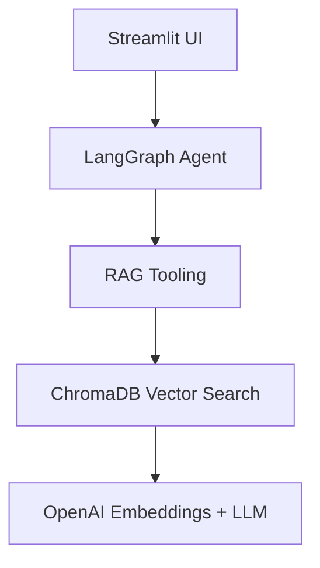

# Serco AI Finance & Strategy Agent

An AI-powered FP&A, Bids, and M&A assistant for Serco, specializing in financial analysis, bid support, M&A, invoice review, financial consolidation, reporting, and strategic business support. Built with LangGraph, LangChain, OpenAI, ChromaDB, and Streamlit using a Retrieval-Augmented Generation (RAG) architecture.

---

## 🚀 Features

- **Multi-document RAG ingestion**: Upload and ingest PDFs, DOCX, and Excel files or entire folders (ZIP) into a persistent vector database (ChromaDB).
- **Semantic search**: Retrieve relevant context from your knowledge base using OpenAI embeddings and cosine similarity.
- **Finance-focused AI agent**: Specialized for FP&A, bids, M&A, invoice review, and financial analysis.
- **Conversational memory**: Persistent chat history for context-aware conversations.
- **Streamlit web UI**: User-friendly chat and ingestion interfaces.
- **Excel-ready outputs**: Generates structured, tabular data for export.

---

## 🏗️ Architecture



**Data Flow:**
1. User uploads documents or chats with the agent via Streamlit UI.
2. Documents are chunked, embedded, and stored in ChromaDB.
3. Agent retrieves relevant context using semantic search (RAG).
4. OpenAI LLM generates responses strictly based on retrieved context.

---

## 🧩 Tech Stack

- **Python 3.11**
- [LangGraph](https://github.com/langchain-ai/langgraph)
- [LangChain](https://github.com/langchain-ai/langchain)
- [OpenAI API](https://platform.openai.com/docs/api-reference)
- [ChromaDB](https://www.trychroma.com/)
- [Streamlit](https://streamlit.io/)
- [Pandas](https://pandas.pydata.org/)
- [PyMuPDF](https://pymupdf.readthedocs.io/)

---

## ⚙️ Installation & Setup

1. **Clone the repository:**
	 ```bash
	 git clone <your-repo-url>
	 cd serco
	 ```
2. **Install dependencies:**
	 ```bash
	 uv sync
	 ```
3. **Set up environment variables:**
	 - Create a `.env` file in the root directory.
	 - Add your OpenAI API key and model name:
		 ```env
		 OPENAI_API_KEY=sk-...
		 OPENAI_LLM_MODEL=gpt-4o
		 ```
4. **Run the Streamlit UIs:**
	 - **Agent UI:**
		 ```bash
		 streamlit run src/ui/ui_agent.py --server.address 0.0.0.0 --server.port 8501
		 ```
	 - **Ingestion UI:**
		 ```bash
		 streamlit run src/ui/ui_ingestion.py --server.address 0.0.0.0 --server.port 8502
		 ```

---

## 🖥️ Usage

### 1. Ingesting Documents

- Use the **Ingestion UI** to upload PDF, DOCX, or Excel files, or ZIP folders containing documents.
- Supported formats: `.pdf`, `.docx`, `.xlsx` (Excel)
- Files are automatically chunked, embedded, and stored in ChromaDB.

### 2. Chatting with the Agent

- Use the **Agent UI** to interact with the Serco AI agent.
- The agent answers strictly based on the ingested knowledge base (no hallucinations).
- Example queries:
	- "Summarize the financials from the latest invoice."
	- "List key risks identified in the bid documents."
	- "Generate an Excel-ready table of consolidated costs."

### 3. CLI Usage

- You can also run the agent via CLI for advanced users:
	```bash
	python src/ai_agent/rag_agent.py
	```

---

## 📁 Project Structure

```
serco/
├── main.py
├── pyproject.toml
├── README.md
├── chroma_db/
│   └── ... (ChromaDB persistent storage)
├── src/
│   ├── main.py
│   ├── test_chromabd_import.py
│   ├── ai_agent/
│   │   └── rag_agent.py
│   ├── chroma_db_functionalities/
│   │   ├── create_embeddings.py
│   │   ├── fetch_result_from_vectorDb.py
│   │   ├── get_vector_store_collection.py
│   │   ├── ingest_files_to_vector_db.py
│   │   ├── load_files.py
│   │   └── smart_chunking.py
│   ├── common/
│   │   └── config.py
│   ├── ui/
│   │   ├── ui_agent.py
│   │   └── ui_ingestion.py
│   └── serco.egg-info/
│       └── ...
```

---

## ⚙️ Configuration

- All configuration (API keys, model names) is handled via `.env` and `src/common/config.py`.
- The OpenAI model is set via the `OPENAI_LLM_MODEL` environment variable.

---

## 🤝 Contributing

Contributions are welcome! Please open issues or pull requests for bug fixes, features, or improvements.

---

## 📄 License

This project is licensed under the MIT License.

👤 Author

Athira Jyothish Kumar — Telecom OSS/BSS engineer transitioning into Python/AI engineering.
