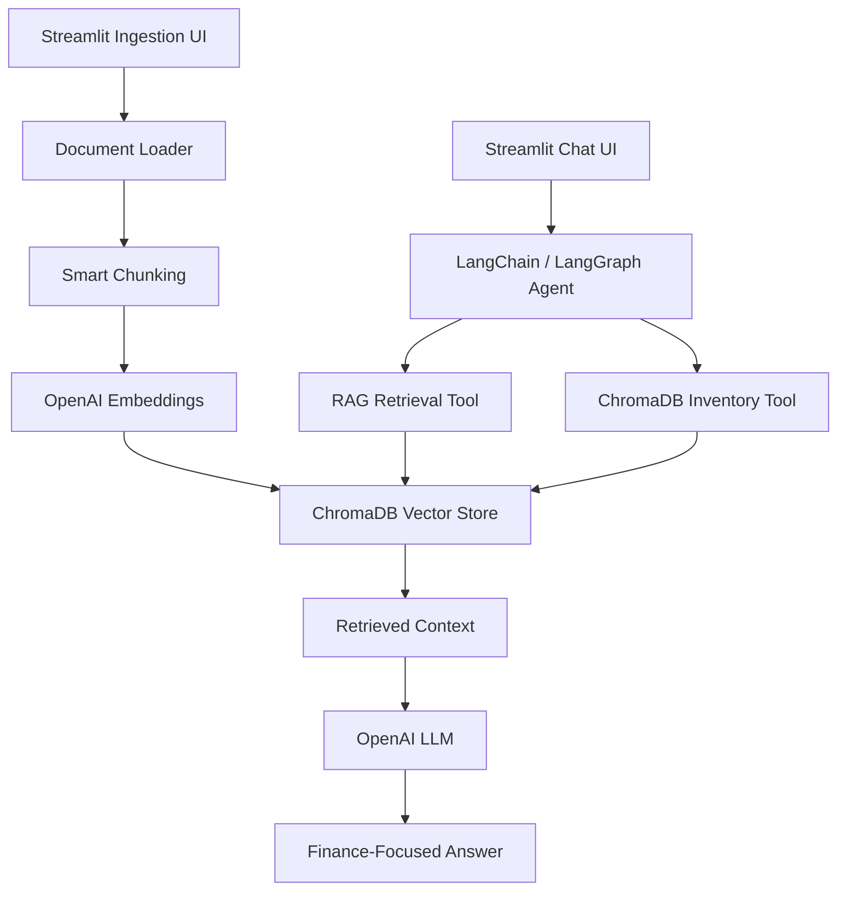

# Serco AI Finance & Strategy Agent

An AI-powered FP&A, Bids, M&A, invoice review, and financial analysis assistant built using **LangChain**, **LangGraph**, **OpenAI**, **ChromaDB**, and **Streamlit**.

The application uses a Retrieval-Augmented Generation (RAG) architecture to answer questions strictly from uploaded Serco-related business and finance documents.

---

## 🚀 Features

* **Multi-document RAG ingestion**

  * Upload PDF, DOCX, Excel files, or ZIP folders through a Streamlit ingestion UI.
  * Supports folder ingestion with subfolders when uploaded as ZIP.

* **Persistent ChromaDB vector database**

  * Documents are loaded, chunked, embedded, and stored in ChromaDB.
  * ChromaDB path is fixed at project root to avoid accidentally creating multiple databases from different terminal locations.

* **Smart document chunking**

  * Uses recursive character-based chunking with overlap to preserve context across document sections.

* **OpenAI embeddings**

  * Converts document chunks into vector embeddings using OpenAI embedding models.

* **Semantic search**

  * Retrieves relevant document chunks from ChromaDB using cosine similarity.

* **Finance-focused AI agent**

  * Specialized for FP&A, bids, M&A, invoice review, financial consolidation, reporting, and strategic business support.

* **Knowledge base inventory tools**

  * The chat agent can answer:

    * How many files are uploaded?
    * What files are stored in ChromaDB?
    * How many chunks are stored?
    * Which documents are available in the knowledge base?

* **Knowledge base management**

  * Ingestion UI includes options to:

    * Delete a selected file from ChromaDB.
    * Clear all ChromaDB contents when required.

* **Conversational Streamlit UI**

  * Chat interface for asking business and finance questions.
  * Ingestion interface for uploading and managing knowledge base content.

* **Excel-ready outputs**

  * Agent can generate structured summaries, tables, and Excel-friendly outputs.

* **Public demo support**

  * App can be exposed temporarily using ngrok for testing or demo purposes.

---

## 🏗️ Architecture



---

## 🔄 Data Flow

1. User uploads PDF, DOCX, Excel, or ZIP files through the ingestion UI.
2. Files are loaded and converted into text.
3. Text is split into overlapping chunks.
4. Each chunk is converted into an embedding using OpenAI.
5. Chunks, embeddings, and metadata are stored in ChromaDB.
6. User asks a question in the chat UI.
7. The agent retrieves relevant chunks from ChromaDB.
8. The LLM answers strictly using the retrieved knowledge base context.
9. For file inventory questions, the agent uses ChromaDB metadata tools instead of semantic search.
10. Admin can delete selected files or clear the vector database from the ingestion UI.

---

## 🧩 Tech Stack

* **Python 3.11**
* **uv** for Python environment and dependency management
* **LangChain**
* **LangGraph**
* **OpenAI API**
* **ChromaDB**
* **Streamlit**
* **Pandas**
* **PyMuPDF**
* **python-docx**
* **ngrok** for temporary public sharing

---

## ⚙️ Installation & Setup

### 1. Clone the repository

```bash
git clone https://github.com/YuukiKibum/enterprise-rag-finance-agent.git
cd enterprise-rag-finance-agent
```

### 2. Install dependencies

```bash
uv sync
```

### 3. Create `.env` file

Create a `.env` file in the project root.

```env
OPENAI_API_KEY=your_openai_api_key_here
OPENAI_LLM_MODEL=gpt-4o
```

Do not commit your `.env` file to GitHub.

---

## ▶️ Running the App

Run all commands from the project root:

```powershell
cd "C:\AI Agent Projects\Python_Projects\serco"
```

### Run the Chat Agent UI

```powershell
uv run streamlit run .\src\ui_agent.py --server.port 8502
```

Open:

```text
http://localhost:8502
```

### Run the Ingestion UI

```powershell
uv run streamlit run .\src\ui_ingestion.py --server.port 8503
```

Open:

```text
http://localhost:8503
```

---

## 📚 Usage

### 1. Ingest Documents

Use the ingestion UI to upload files into ChromaDB.

Supported formats:

```text
.pdf
.docx
.xlsx
.xls
.zip
```

For folders, compress the folder as a ZIP file and upload it through the folder upload section.

The ingestion process will:

1. Load the document.
2. Extract readable text.
3. Split text into chunks.
4. Create embeddings.
5. Store chunks, embeddings, and metadata in ChromaDB.

---

### 2. Manage Knowledge Base Content

The ingestion UI includes a ChromaDB management section.

You can:

* View total files stored.
* View total chunks stored.
* Delete one selected file from ChromaDB.
* Clear all ChromaDB content.

Deleting content from ChromaDB removes the vector database records only. It does not delete your original source files from your laptop.

---

### 3. Chat with the Agent

Use the chat UI to ask questions about uploaded documents.

Example questions:

```text
Summarize the financials from the latest invoice.
```

```text
List key risks identified in the bid documents.
```

```text
Generate an Excel-ready table of consolidated costs.
```

```text
What are the main commercial risks in the uploaded documents?
```

```text
Compare revenue and cost assumptions across the uploaded files.
```

---

### 4. Ask Knowledge Base Inventory Questions

The agent can also answer questions about what is stored in ChromaDB.

Example questions:

```text
How many files are uploaded?
```

```text
What files are in ChromaDB?
```

```text
List all file names in the knowledge base.
```

```text
How many chunks are stored?
```

```text
Which documents are available for analysis?
```

---

## 🌐 Exposing the App Publicly with ngrok

You can expose the chat app temporarily using ngrok.

### 1. Start the Streamlit chat app

```powershell
uv run streamlit run .\src\ui_agent.py --server.port 8502
```

### 2. Start ngrok in another terminal

```powershell
ngrok http 8502
```

ngrok will generate a public URL like:

```text
https://example-name.ngrok-free.dev
```

Anyone with this URL can access the chat app while your laptop, Streamlit, and ngrok are running.

### Optional: Add basic authentication

```powershell
ngrok http 8502 --basic-auth="serco:YourStrongPassword"
```

### Security Note

Do not expose the ingestion UI publicly unless it is protected. The ingestion UI can upload files, delete selected files from ChromaDB, and clear the entire vector database.

Recommended public exposure:

```powershell
uv run streamlit run .\src\ui_agent.py --server.port 8502
```

Avoid publicly exposing:

```powershell
uv run streamlit run .\src\ui_ingestion.py --server.port 8503
```

---

## 📁 Project Structure

```text
serco/
├── README.md
├── pyproject.toml
├── uv.lock
├── .env
├── .gitignore
├── chroma_db/
│   └── ... ChromaDB persistent vector storage
│
├── src/
│   ├── ui_agent.py
│   ├── ui_ingestion.py
│   │
│   ├── ai_agent/
│   │   └── rag_agent.py
│   │
│   ├── chroma_db_functionalities/
│   │   ├── create_embeddings.py
│   │   ├── fetch_result_from_vectorDb.py
│   │   ├── get_vector_store_collection.py
│   │   ├── ingest_files_to_vector_db.py
│   │   ├── load_files.py
│   │   ├── smart_chunking.py
│   │   └── vector_db_inspection.py
│   │
│   └── common/
│       └── config.py
```

---

## 🧠 Main Components

### `ui_agent.py`

Streamlit chat interface for interacting with the Serco AI Finance & Strategy Agent.

It provides:

* Chat-based question answering.
* RAG-based retrieval from ChromaDB.
* Knowledge base file inventory support.
* Session-based chat history.

---

### `ui_ingestion.py`

Streamlit ingestion and ChromaDB management interface.

It provides:

* File upload.
* ZIP folder upload.
* Ingestion status display.
* ChromaDB file summary.
* Delete selected file from ChromaDB.
* Clear all ChromaDB content.

---

### `ingest_files_to_vector_db.py`

Handles document ingestion.

It performs:

* File validation.
* Text loading.
* Smart chunking.
* Embedding creation.
* Metadata generation.
* ChromaDB storage.

---

### `get_vector_store_collection.py`

Creates and returns the ChromaDB collection.

The ChromaDB path is fixed to the project root so the same vector database is used even if the app is run from different terminal locations.

---

### `vector_db_inspection.py`

Provides ChromaDB inspection and management functions.

It supports:

* Reading ChromaDB metadata.
* Counting files.
* Counting chunks.
* Listing stored file names.
* Deleting one document by `doc_id`.
* Clearing all ChromaDB records.

---

### `fetch_result_from_vectorDb.py`

Retrieves relevant document chunks from ChromaDB based on the user query.

---

### `load_files.py`

Loads supported file types and converts them into text.

Supported loaders:

* PDF using PyMuPDF.
* DOCX using python-docx.
* Excel using Pandas.

---

### `smart_chunking.py`

Splits document text into manageable overlapping chunks using recursive character splitting.

---

### `create_embeddings.py`

Creates OpenAI embeddings for text chunks.

---

## ⚙️ Configuration

Configuration is handled using environment variables.

Example `.env`:

```env
OPENAI_API_KEY=your_openai_api_key_here
OPENAI_LLM_MODEL=gpt-4o
```

The model name is read from:

```text
src/common/config.py
```

---

## 🧪 Recommended Test Flow

After setup, test the project in this order:

### 1. Run ingestion UI

```powershell
uv run streamlit run .\src\ui_ingestion.py --server.port 8503
```

Upload a PDF, DOCX, or Excel file.

Confirm that the UI shows successful ingestion and chunk count.

### 2. Run chat UI

```powershell
uv run streamlit run .\src\ui_agent.py --server.port 8502
```

Ask:

```text
How many files are uploaded?
```

Then ask:

```text
What files are in ChromaDB?
```

Then ask a document-content question, for example:

```text
Summarize the uploaded document.
```

---

## 🛡️ Security Notes

* Do not commit `.env`.
* Do not expose OpenAI API keys.
* Do not expose the ingestion UI publicly without authentication.
* Do not upload confidential or production-sensitive documents to a publicly exposed demo.
* If using ngrok, keep the URL private or protect it with basic authentication.
* Stop ngrok when the demo is finished.

---

## 🧹 Suggested `.gitignore`

```gitignore
.env
.venv/
__pycache__/
*.pyc
chroma_db/
.streamlit/
.DS_Store
```

Do not commit `chroma_db/` unless you intentionally want to version local vector database files.

---

## 🧾 Git Commands

Check changes:

```powershell
git status
```

Add changes:

```powershell
git add .
```

Commit changes:

```powershell
git commit -m "Improve ChromaDB ingestion and knowledge base management"
```

Pull remote changes safely:

```powershell
git pull --rebase origin master
```

Push changes:

```powershell
git push
```

---

## 🤝 Contributing

Contributions, improvements, and suggestions are welcome.

Recommended contribution areas:

* Better file type support.
* User authentication.
* Role-based access for ingestion and chat.
* Better document-level citations.
* Export responses to Excel or PDF.
* Deployment to cloud instead of local ngrok.

---

## 📄 License

This project is licensed under the MIT License.

---

## 👤 Author

**Athira Jyothish Kumar**

Telecom OSS/BSS engineer transitioning into Python and AI engineering, building practical AI applications using LangChain, LangGraph, Streamlit, ChromaDB, and OpenAI.
